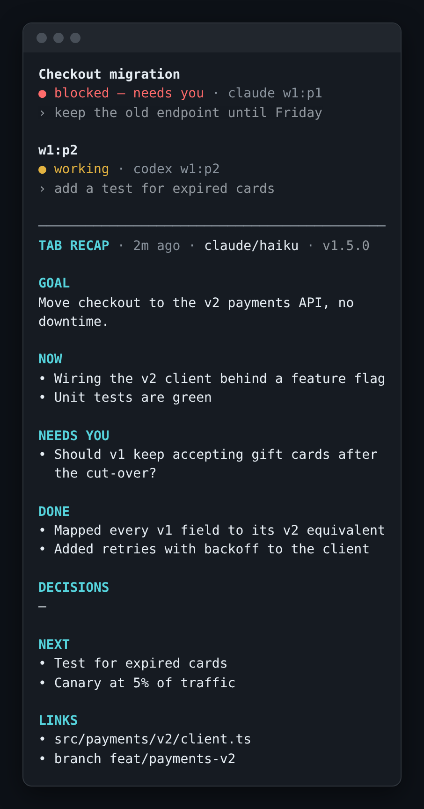
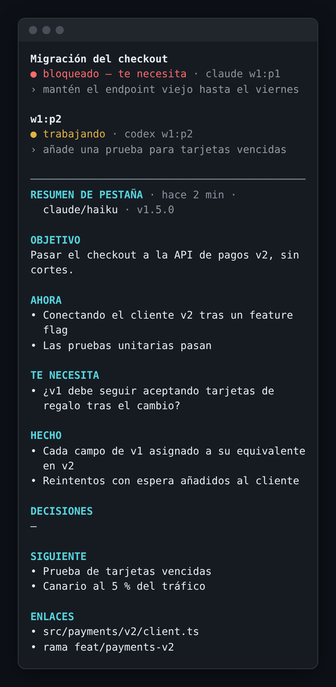
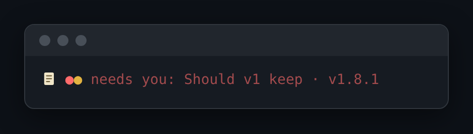
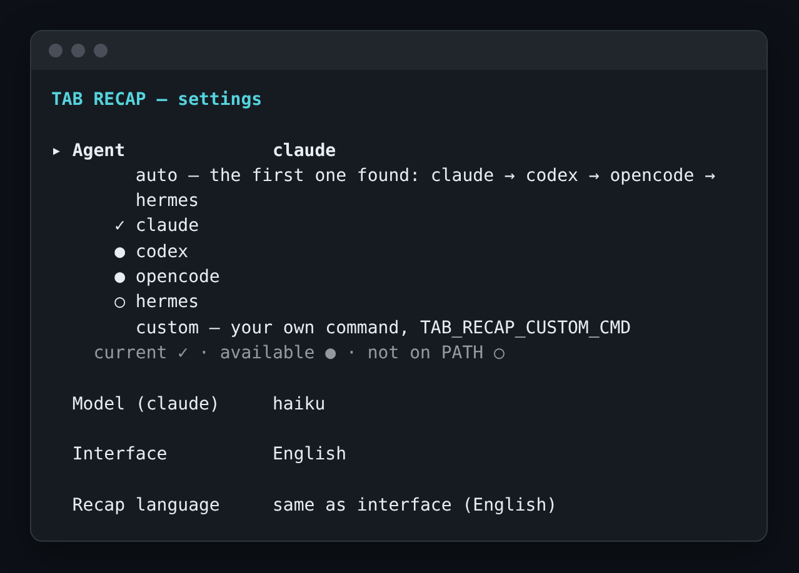

# herdr-plugins

[](https://github.com/crisap94/herdr-plugins/actions/workflows/ci.yml)

Plugins for [herdr](https://github.com/ogulcancelik/herdr), the terminal multiplexer for coding
agents. One plugin per directory, each installable on its own.

## Plugins

| plugin | what it does | docs |
| --- | --- | --- |
| **tab-recap** | a recap column beside every tab with a coding agent | [below](#tab-recap) · [folder](tab-recap) |

## tab-recap

A **recap column** pinned to the right of every herdr tab that has a coding agent in it. It keeps a
rolling, structured recap of the conversation (goal, what is happening now, what needs you, what
is done, decisions, next steps, links — always the same seven sections, kept short), so a long session never loses its thread. A coding agent of your
choice writes it at the end of each turn. Every merge request, commit, branch, file and URL in it is a
link you can open with Ctrl-click. It only reads transcripts; it never types into an agent on its own —
the one exception is the [compaction](#compact-an-agent) you ask for.

Every item is held to one [rubric](tab-recap/schema/recap-rubric.md) (atomic, specific, about the work, with the reason for a
decision, …). Plain-code gates refuse what fails it before the recap is stored, and `tab-recap eval` scores stored recaps against it —
see [how recaps are checked](tab-recap/README.md#how-recaps-are-checked).

<p align="center">
  
  
</p>

On a phone (a narrow tab) you get a one-row **bar** along the bottom instead: a status dot per agent
and one headline. Tap it to open the full recap.

<p align="center">
  
</p>

### Requirements

- herdr ≥ 0.9.0 (Linux or macOS)
- Node ≥ 24.21.0 (runs the TypeScript directly, nothing to build)
- at least one coding agent on your `PATH`: `claude`, `codex`, `opencode` or `hermes` (or your own
  command, see [Who writes the recap](#who-writes-the-recap))
- optional: [`glow`](https://github.com/charmbracelet/glow), for nicer Markdown

### Install

```bash
herdr plugin install crisap94/herdr-plugins/tab-recap
herdr plugin action invoke tab-recap.start
```

`start` turns it on, and it stays on across herdr restarts. Working from a checkout? Use
`herdr plugin link ./tab-recap` instead of `install`.

### First run

Open a tab with a `claude` or `codex` agent. Within a moment a narrow column appears on the right;
it fills in when the agent finishes its first turn (or press `r` in the column to write it now).

Open the settings:

```bash
herdr plugin action invoke tab-recap.configure
```

<p align="center">
  
</p>

Pick the agent and model and the languages. Press **`t`** to run a test with the
current choices (it shows ✓ and how long it took, or why it failed), **`s`** to save, **`q`** to
close. Changes apply to the next recap.

The plugin binds no keys by default. To hide and show columns and to compact an agent with a key,
add this to `~/.config/herdr/config.toml`:

```toml
[[keys.command]]
key = "prefix+r"
type = "plugin_action"
command = "tab-recap.column"      # hide / show this tab's column

[[keys.command]]
key = "prefix+shift+r"
type = "plugin_action"
command = "tab-recap.columns"     # hide / show every column

[[keys.command]]
key = "prefix+shift+c"
type = "plugin_action"
command = "tab-recap.compact"     # compact the focused agent
```

Use any free keys (`prefix+c` is herdr's own "new tab", so avoid it). Then run
`herdr server reload-config`. The same way you can bind `tab-recap.configure` (the settings) or
`tab-recap.refresh` ("recap this tab now").

### Everyday use

- **Column** (wide tabs): the recap, always visible. By default it appears for `claude`, `codex`
  and `opencode` agents.
- **Bar** (tabs narrower than 110 cells, like a phone): one row along the bottom.
- **Tap** the bar or the column, or press **Enter** in the column, to open the [expanded view](#the-expanded-view)
  as a modal over everything. **`q`** or **Esc** closes it.
- In the column or the modal: **`j`/`k`** or the arrow keys scroll, **Space**/**`b`** page down/up,
  **`g`**/**`G`** jump to top/bottom, **`r`** writes a new recap now, **`c`** compacts the focused
  agent.
- **Ctrl-click** a reference (`!252`, a commit, a branch, a file, a URL) to open it in your browser.
- A lane that has used 40 % of its context shows **`compact? 45% of 1M`**: a hint, nothing more.
- Recaps are written at the end of each turn, when you focus a tab whose recap is stale, and on
  `r`.
- One recap per tab, covering all its agents.

The same views are available as actions: `tab-recap.show` (the modal), `tab-recap.refresh`
(recap this tab now), `tab-recap.column` (hide or show this tab's column) and `tab-recap.columns`
(all columns). Hiding is remembered across restarts and recaps keep being written.

### The expanded view

Where the column is a short summary, the **expanded view** (Enter or a tap on the column, `tab-recap.show`)
shows everything that happened, with no model call to wait for — it is another way of drawing the same facts:

- **Goal · Now · Needs you** — each question says how long it has waited (`waiting 25 min`), oldest first.
- **Timeline** — what got done and what was closed, newest first, with the time of each (a date line when
  the day changes) and, for a fact that closed without being done, why (`closed: wrong`).
- **Decisions** with their why on the next line · **Next** · **Rules** · **Links**.
- **Session** — computed from the store, never written by a model: when the tab started and for how long, the
  turns by cause, the compactions with their tokens (`800k → 14k`), each agent's share of its context window, the
  repository and branch, the files edited most. A line whose data is not known is left out.

From 140 cells wide it is two columns (the story on the left, the reference on the right, scrolled
together); narrower, one column in that order. The keys are the modal's: `j`/`k`, Space/`b`, `g`/`G`, `r`, `c`,
`s`, `q`.

<!-- screenshot: tab-recap/docs/screens/expanded-en.png (regenerated when the chapters change lands) -->

A **curator** also runs when the view opens and the facts changed since it last ran (at most once per five
minutes per task): it closes leftover near-duplicates as *merged* into the fact that says it better, and writes
a short "session so far" paragraph (at most 120 words) shown at the top. The view never waits for it: it shows
the last paragraph and `updating…`, and redraws when the new one is stored. The curator is a job in the
settings' **Models** group (`TAB_RECAP_CURATE_BY` / `_MODEL` / `_EFFORT`; by default the recap writer's harness
at medium effort; `off` turns it off).

### Clickable links

References in the recap are real links (OSC 8 hyperlinks, which herdr opens on Ctrl-click, also when
a link wraps). They keep their short text:

| the recap says | opens |
| --- | --- |
| a full URL | that URL |
| `!252` / `#12` | the merge request (GitLab) / the pull request (GitHub) |
| a commit like `ca9a099` | the commit |
| `` `feat/cart` `` | the branch |
| `` `src/cart.ts` `` | the file on the agent's current branch |

The web address comes from the repository's `origin` remote (SSH remotes become https; a token in the
remote is never stored or shown); github.com gets GitHub paths, any other host GitLab paths. When the
agents of one task work in different repositories, only full URLs are linked.

### Compact an agent

Long sessions get compacted, and the agent's own summary decides what survives. tab-recap can steer
it: press **`prefix+shift+c`** (your binding), or **`c`** in the column, or run `tab-recap.compact`.

1. A small popup asks for an **optional note** (up to 280 characters) — what must not be lost. Enter with nothing skips it,
   Esc cancels.
2. The recap is refreshed, and the **focused agent** gets — only if it is idle — a message in your own
   words (it never learns that a recap or plugin exists) asking it to keep, in this order: your note,
   the goal, decisions and why, questions waiting for you, unfinished work and next steps, rules you
   gave it, and exact references.
3. **Claude** runs `/compact` with that guidance. **Codex** and **opencode** run their own `/compact`,
   then get one short "here is where we stand, reply ok" message.

While it runs, the agent's header in the column (and the headline of the phone bar) shows where it is, in
place of the `compact?` hint: `✎ writing what to keep… (codex · gpt-6-luna · high) 0:08`, then
`◐ compacting… 0:12`, then (Codex, opencode) `◐ telling it where things stand…`, and at the end
`✓ compacted 39.5k → 3.1k · 16 s` (`· template` when the brief could not be written and the template was
sent), `✗ not compacted: …`, `? not confirmed — check it` or `– not compacted: working`. The tokens and the
time are what the agent's own records say; a number they do not give is left out. The result stays until
the agent's next turn. A word like "tab" or "recap" is only kept out of the message when the agent's own
conversation never uses it.

A working or blocked agent is never typed into: it is skipped and you are told. A lane whose context
passes 40 % of its window shows `compact? 45% of 1M`; the window is read from the agent itself where it
says (Codex), from opencode's local model catalogue, or from a small table for Claude, and corrected
by what has been seen. `TAB_RECAP_COMPACT_TARGET`, `TAB_RECAP_COMPACT_HINT` and
`TAB_RECAP_CONTEXT_WINDOW` change who is compacted, the hint threshold and the window.

### Who writes the recap

By default (`auto`) the first agent found on your `PATH` writes it, in this order: `claude`,
`codex`, `opencode`, `hermes`. To choose, use the settings modal (`tab-recap.configure`), or from a checkout:

```bash
node bin/tab-recap.ts backend codex gpt-6-luna   # an agent and, optionally, a model
node bin/tab-recap.ts backend auto               # back to the default
```

Each agent remembers its own model; leave it empty
for the agent's default. `opencode` wants `provider/model`. The writer runs at **medium effort** by
default (`TAB_RECAP_EFFORT`: `low`, `medium`, `high`, or `default` to leave it to the agent; `low` records
choices as open questions instead of decisions, measured), and
Codex without the agent features a recap never needs.

The writer receives one XML document per run (version 2) — the tab's agents with their repository and branch,
the ledger of facts so far, the agents' own summaries, and each new prompt, reply and tool call with its
time — defined by [`tab-recap/schema/recap-input.dtd`](tab-recap/schema/recap-input.dtd). It answers
**operations** on the ledger (`add`, `update`, `close`), not a whole new recap; see
[How the recap is kept](tab-recap/README.md#how-the-recap-is-kept).

**Your own command:** set `TAB_RECAP_BACKEND=custom` and `TAB_RECAP_CUSTOM_CMD` to a command line
(no shell) that reads the prompt (the version 2 document, then the instructions) on stdin and prints the JSON
object of operations the instructions ask for on stdout:
`{"ops": [{"op": "add", "section": "done", "text": "…"}, {"op": "close", "id": "f3", "why": "done"}]}`.
Ids (`f1`, `f2`, …) are the ones of the `<ledger>` in the document; `{"ops": []}` means nothing changed.
**Breaking since 2.0:** a command that still answers the old recap JSON (`{"goal": …}`) is refused — the run fails
with `custom writer must answer operations (see README)` in the log and nothing is stored.

### Languages

- **Interface** (column, footer, messages): `en` or `es`, or `auto` to follow your locale.
  `TAB_RECAP_LOCALE`
- **Recap language**: `ui` (same as the interface), `en`, `es`, or any language name such as
  `Português`. Changing it rewrites the recap at once. `TAB_RECAP_RECAP_LANG`

### Settings

Everything lives in a `config.env` file of `KEY=VALUE` lines. Find the folder with:

```bash
herdr plugin config-dir tab-recap
```

Copy [`config.example.env`](tab-recap/config.example.env) there and edit. It is re-read on every
recap, so no restart is needed (except for the keys marked *restart* in the example). Environment
variables win over the file. The ones people change:

| key | default | what it does |
| --- | --- | --- |
| `TAB_RECAP_BACKEND` | `auto` | who writes the recap |
| `TAB_RECAP_WIDTH` | `0.3` | column width as a share of the tab |
| `TAB_RECAP_MIN_TAB_COLS` | `110` | narrower tabs get a bar (*restart*) |
| `TAB_RECAP_AGENTS` | `claude,codex,opencode` | agent kinds that get a column (*restart*) |
| `TAB_RECAP_LOCALE` | `auto` | interface language |
| `TAB_RECAP_RECAP_LANG` | `ui` | recap language |
| `TAB_RECAP_EFFORT` | `medium` | how hard the writer thinks |
| `TAB_RECAP_COMPACT_TARGET` | `focused` | who `compact` acts on: `focused`, `all`, or kinds like `claude,codex` |
| `TAB_RECAP_COMPACT_HINT` | `40` | % of the context window that shows the hint (`off`, or 10–95) |
| `TAB_RECAP_CONTEXT_WINDOW` | *(detected)* | force a context window in tokens |

### Troubleshooting

Start with:

```bash
herdr plugin action invoke tab-recap.status
```

It prints whether the daemon runs, which agent writes recaps, and the state and config folders. The
daemon log is `daemon.log` in that state folder (by default
`~/.local/state/herdr/plugins/tab-recap/`).

- **"No recap writer found"**: no agent was found on your `PATH`. Install `claude`, `codex`,
  `opencode` or `hermes`, or set `TAB_RECAP_BACKEND` and `TAB_RECAP_CUSTOM_CMD`.
- **No column appears**: the tab needs an agent of a kind in `TAB_RECAP_AGENTS` (default `claude`,
  `codex` and `opencode`), and the daemon must be on (`tab-recap.start`).
- **A link does not open**: hold **Ctrl** while clicking (herdr's modifier on every platform); your
  terminal must pass the modified click to herdr.
- **Compact did nothing**: the agent was busy or waiting on a dialog — you get a notification naming
  it. Try again when it is idle.
- **The column keeps closing**: if you close it, the daemon reopens it, but at most 3 times in 2
  minutes. After that it leaves you alone for 10 minutes. To turn it off for good, run
  `tab-recap.stop`.
- **Turn it off**: `herdr plugin action invoke tab-recap.stop` closes every column and stays off
  until you run `tab-recap.start` again.

The full reference (all actions, the extension point, the design) is in
[`tab-recap/README.md`](tab-recap/README.md).

## Contributing

Issues and pull requests are welcome. See [CONTRIBUTING.md](CONTRIBUTING.md) for setup, the checks
to run and how pull requests flow.

## Changelog

Release notes are in [CHANGELOG.md](CHANGELOG.md); what is planned next is in [ROADMAP.md](ROADMAP.md).

## License

[MIT](LICENSE) © 2026 crisap94
