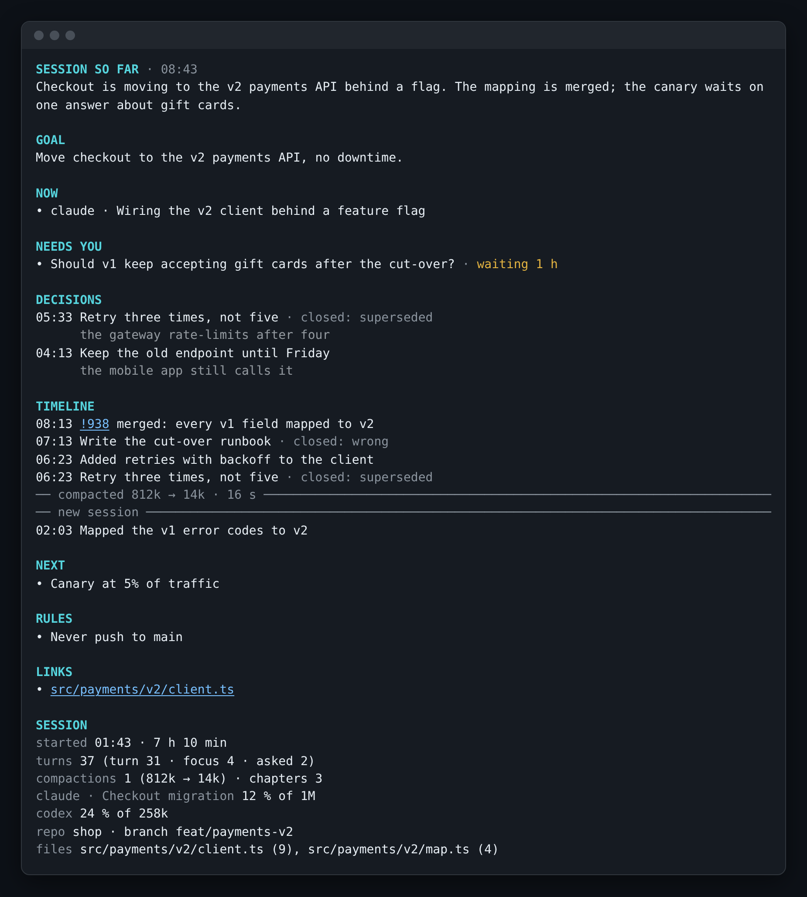

# Tab Recap

A **recap column** pinned to the right of every herdr tab that has a coding agent in it. It keeps
a ledger of **facts** about the conversation and shows the open ones, so a long session never loses its thread:

```text
 Payments API migration
 ● idle · claude · recap 2m ago
 ⚑ idle 12m ago · feat/x · 7 unmerged · dirty
 › keep the old endpoint until Friday

 GOAL
 Move checkout to the v2 API
 NOW
 • Running CI on !940
 NEEDS YOU
 • Approve the prod deploy
 DONE · DECISIONS · NEXT · LINKS
```

- **On a phone, a bar.** A narrow tab gets a one-row bar along the bottom instead — a status dot
  per agent and one headline (what needs you, else what is happening now). **Tap it** (or tap the
  column on a desktop) and the [expanded view](#the-expanded-view) opens as a modal over everything; `q` closes it.
- **Know what is deployed.** The column's top line ends with the plugin version on disk (`· v1.8.0`); when the running daemon is another version, a yellow `daemon v1.7.0 — restart` says so.
- **Per tab, by default.** A daemon opens the column in every tab with an agent of a kind in
  `TAB_RECAP_AGENTS` (default `claude`, `codex` and `opencode`), the moment the agent appears, keeps it narrow, and reopens it if it is closed (up to
  3 times in 2 minutes — then it respects you for 10 minutes, `TAB_RECAP_GIVE_UP_MS`). A close herdr has not done after 30 s (`TAB_RECAP_CLOSE_GRACE_MS`) is asked again and counts against the same budget.
- **One recap per piece of work, from all its panes.** Every agent in the tab gets a short header (title,
  status, extension notes, last prompt); below them, ONE recap covers the tab's work as a whole. A tab
  is not assumed to be one task: when its agents work on unrelated things (different repositories, say),
  the plugin groups them into **tasks** by where they work (the repository, else the folder) and each task gets
  its own recap under its own name — the grouping stays put once made. The bar's headline takes the most urgent
  "needs you" of any task.
- **Every agent can get a column.** `claude`, `codex` and `opencode` are read from their own history
  (opencode's SQLite database is opened read-only). Any other agent herdr recognises can be read from its
  **screen** instead — `TAB_RECAP_SCREEN_AGENTS=gemini,qwen` (or `all`), also a row in the settings; its
  header says `(screen)`, because an agent on the alternate screen shows only what is visible. Reading
  a screen never types into the pane.
- **Written at the end of each turn** by any harness — `claude`, `codex`, `opencode`, `hermes` (the
  first one found, or the one you pick), or your own command —
  as operations on the ledger of facts plus only the new part of every agent's transcript (see [How the recap is kept](#how-the-recap-is-kept)). Also on tab focus when
  stale, and on `r` in the column or the modal. `hermes` runs in safe mode with only its `clarify` tool
  (it cannot run with zero tools; `clarify` cannot touch files, a shell or the network).
- **Clickable references.** Every merge request (`!252`), pull request or issue (`#12`), commit, branch
  and file written in backticks, and every full URL, is an OSC 8 hyperlink that herdr opens on
  Ctrl-click — in every section, in the column and the modal, also when it wraps. The address comes from
  the repository's `origin` remote (ssh made https, credentials never kept; github.com gets GitHub
  paths, other hosts GitLab paths); files open on the agent's current branch. When a task's agents work
  in different repositories, only full URLs are linked.
- **What the writer sees.** One XML document (version 2) per run, defined by
  [`schema/recap-input.dtd`](schema/recap-input.dtd) and validated in tests: the tab's agents (folder,
  repository, branch, recently edited files), the **ledger** (open facts of every task, plus the ones closed
  in the last two hours, newest last, each with an id the answer refers to), the agents' own away and compaction
  summaries as hints, and per agent the new prompts (including ones typed while it was busy), replies
  (beginning and end) and tool calls (Codex's decoded; plain reads only counted), each with its time.
  The writer runs at `TAB_RECAP_EFFORT` (`medium` by default) and closes any earlier fact the transcript
  contradicts.
- **Extensible.** An optional extension can add notes under a lane's header and do housekeeping
  on the daemon's tick (see `src/extensions/` and `CONTEXT.md`); none are loaded by default.
- **English or Spanish.** The column and the commands speak `en` or `es` (`TAB_RECAP_LOCALE`), and the recap can be
  written in either or in any language you name (`TAB_RECAP_RECAP_LANG`); switching rewrites it at once.
- **Read-only, but for one thing you ask for.** It reads transcripts and never types into an agent on its own (a lint rule says so). The one exception is [compaction](#compaction), and only when you ask for it.

## What the recap is

The recap is a **ledger of facts**, each one line (16 words at most) in one of eight sections, always in the
same order in the column: Goal, Now, Needs you, Done, Decisions, Next, Links and Rules. An empty section
shows `—`. A fact keeps its identity: when it first appeared and was last confirmed, which turn it came
from, and — for a decision — its **reason**. At the end of a turn the writer is shown the facts that are
open (and the ones closed in the last two hours) and answers **operations**: `add` what is new, `update`
what changed, `close` what finished (`done`), was wrong (`wrong`), was replaced (`superseded`) or was
answered (`answered`). Nothing is regenerated, so nothing is rephrased turn after turn, and a closed fact
stays in the story with its reason.

- **The column and the bar** draw the open facts: the newest of each section, capped (the goal is one line;
  now 3, needs 3, done 5, decisions 3, next 5, links 6, rules 5). The caps are a rule of the *view*, enforced
  in code; the store keeps every fact.
- **The expanded view** (Enter or a tap) draws all of it — see below.
- **From 1.x:** migration 6 imports the lines your old recaps carried as facts (equal lines of a task across
  runs become one fact; the last good run's are open, the rest closed as `rewritten`); every task's column
  reads the same after the upgrade as before. The old `item` table stays, read-only, until 2.1.

## The expanded view

`tab-recap.show`, Enter in the column or a tap on the bar or the column opens the whole session from the
ledger, at once and with no model call. In order: the curator's *session so far* paragraph (when there is one),
**Goal**, **Now**, **Needs you** (oldest first, each with how long it has waited), **Timeline** (done facts
and every closed fact, newest first, with the time and, for a closed fact, why it closed; a date line when the
day changes), **Decisions** (the text, then its reason), **Next**, **Rules**, **Links** and **Session facts**:

```text
started 09:12 · 6 h 12 min          turns 41 (turn 36 · focus 3 · asked 2)
compactions 2 (800k → 14k · 39k → 3k) · chapters 3
claude · orchestrator  34 % of 1M   codex · host  12 % of 272k
repo herdr-plugins · branch main
files src/cart.ts (7), src/checkout.ts (5), …
```

The session facts are computed from the store and the agents' own records, never written by a model; a
fact that is not known is left out. From 140 cells wide the view has two columns (story left, reference
right); narrower, one column in that order. Scrolling and keys are the modal's: `j`/`k`, Space/`b`, `g`/`G`,
`r`, `c`, `s`, `q`/Esc.

**Breaks.** Where an agent compacted, the timeline draws a gray line across the column with the tokens
before and after and how long it took when the agent's records say so (`── compacted 800k → 14k · 16 s ──`;
`── compacted ──` when they do not, never a guess); where a new conversation began in the same pane it
draws `── new session ──`. See [Chapters](#chapters-and-retention).

**Session facts** are computed, never written by a model; the files edited most are counted from the agents' own
records, read-only (the most recent 4 MB of each).



**The curator** is a job like the others (see [Models](#models)) that runs when the view opens and the facts changed
since it last ran, at most once per five minutes per task. It may close facts as *merged* into another and writes the
"session so far" paragraph shown at the top (at most 120 words); anything else it answers is refused and logged. The
view shows the last paragraph with its time and `updating…` while the curator runs, and never waits for it.

## Chapters and retention

A session breaks when an agent compacts its context or a new conversation starts in the same pane. After
each read of an agent's transcript the plugin records every compaction the agent's own records show that
is newer than the lane's last break — Claude's `compact_boundary`, Codex's `compacted` row, opencode's
compaction answer — as a **boundary** with the record's own time and tokens, and a new transcript in a pane that
had one as a `switched` boundary naming the transcript it replaces. A compaction is **manual** when the
plugin started one for that lane in the ten minutes before the record, else **auto**; a compaction the
plugin drove points at its boundary (`compaction.boundary_id`). A boundary seals the tab's current **chapter**
and opens the next in the same transaction; the run that follows belongs to it. A compaction the plugin did
not drive is only known at the next read, but its boundary carries the record's own time, so the timeline is
right even when it was recorded late. opencode's marks are tested on recorded fixtures only.

**Retention.** `TAB_RECAP_KEEP_DAYS` (default 30; `0` keeps everything): the daily upkeep removes a tab last
seen longer ago than that and with no column open, with its facts, runs, saved inputs, verdicts, chapters,
boundaries and compaction records — one transaction per tab, logged with the counts. A tab seen within the
period is never touched, whatever its size.

## How the recap is kept

Since 2.0 a recap is not rewritten on every turn: it is a **ledger of facts** per task. A fact has an id, a
section (goal, now, needs, done, decisions, next, links, rules), a text of at most 16 words, a why (always for a
decision), an optional reference and agent, when it was first and last seen, and a state: *open*, or *closed* with
the reason — `done`, `wrong`, `superseded`, `answered` (the writer), `merged` or `rewritten` (the upkeep and the import).
Facts are never deleted.

The writer is shown the task's open facts (and those closed in the last two hours) as `<ledger>` in the version 2
document, with ids `f1…fn`, plus only what is new in each transcript, and answers **operations** only:

```json
{"ops": [
  {"op": "add", "section": "done", "text": "Opened !34 for feat/cart", "why": null, "ref": "!34", "at": "16:41", "agent": "a1"},
  {"op": "update", "id": "f12", "text": "Merge !34 after the pipeline", "why": null},
  {"op": "close", "id": "f3", "why": "done"}
]}
```

Closes are applied first, then updates, then adds, in one transaction with the run. An operation naming an unknown id,
changing a closed fact, closing without a reason, adding a second goal, or adding what the ledger already says is
**refused**, sent back to the writer once with the reason, and dropped if it is still refused. `goal` is one open fact
per task: adding one closes the previous as `superseded`.

**Anchors.** Every `add` carries an `"anchor"`: at most 120 characters copied word for word from the turn, tool call or agent
note the fact comes from. A gate checks that the quote is in the input (whitespace and punctuation are folded, case is kept), so
"supported" is checked by code before the judge looks at it; the quote is stored with the fact and shown to the writer in the
ledger. An `update` may carry an anchor too; a `close` never does. A fact imported from 1.x has none.

The column, the bar and the modal draw, per task and section, the **newest open facts** under the same caps as always
(now 3, needs 3, done 5, decisions 3, next 5, links 6, rules 5, one goal). The caps only decide what is *shown*: the
database keeps every fact, and the compaction brief is written from all of them, closed ones with their reasons.

**Upgrading from 1.x:** the first start of 2.0 copies the database to `tab-recap.db.v5.bak`, then turns the stored
recaps into facts — equal lines of a task across runs become one fact with its first and last time, the last good run's
lines are open, the rest are closed as `rewritten`, a decision that never said why carries "(not recorded)". Every
column shows exactly what it showed before. The old `item` rows are kept, no longer written.

**Breaking, for a custom writer:** `TAB_RECAP_CUSTOM_CMD` now receives the version 2 document and must print the
`{"ops": [...]}` object above (one task: no `task` field; several: an `add` may carry `"task": "t2"`). A command that still
prints the old recap JSON makes the run fail with `custom writer must answer operations (see README)` in the log, and
nothing is stored: the old shape has no ids to operate on.

**Measure it:** `node bin/tab-recap.ts eval --replay <transcript.jsonl> [--kind claude|codex] [--tab <label>]
[--compare-imported <tab>] [--pipeline one|enumerate|enumerate+gates|full]` reads a stored transcript from the start, runs the writer once per turn against a
scratch database in a temporary directory (the real one is never written), judges the facts it leaves with the judge job (the same
report as `eval --sample`, below), and prints the ledger it ends with. `--compare-imported` reads the tab's 1.x recaps from the
real database (read-only) and judges, **per chapter**, the last good 1.x recap of the chapter as one state against the replay's
ledger state at the same time — the same key facts, the same read-back questions, the same evidence (the chapter's turns, without
the ledgers the replay's own writer was shown) — and prints them side by side per chapter and summed. The report names the
pipeline, the writer job and the judge job, so two reports can be compared. With the judge job off it prints the checks that
need no model.

**How a turn is read.** The new turns of a run are not summarised in one call. They go through a *pipeline*
(`TAB_RECAP_PIPELINE`, default `one`):

1. **Enumerate.** A long turn is cut into chunks of at most 6 000 characters (between turns; inside a turn, between bursts of
   tool calls) and each chunk is read by one call at *low* effort that goes through every section and lists the facts it
   holds, each with a quote copied from the chunk (the *anchor*) — or none. Events a session is made of are never left to the
   model's attention: a `git commit`/`merge`/`push`/`tag`, `gh pr`/`release`, `glab mr`, an edit, an error (`Error`, `FAIL`, `✖`,
   `Traceback`) and a question found by plain code become *triggers* the call must either turn into a candidate or skip with a
   reason; a trigger it ignores still reaches the writer, flagged.
2. **Ask back** (`full` only). When the turn was long (more than one chunk) or the candidates are few (fewer than one per 2 000
   characters), the six read-back questions no candidate answers, and what changed about the open facts the turn mentions,
   drive one more enumeration restricted to those questions. Never a third.
3. **Reconcile.** The writer — the recap writer job, at its own effort — is given the candidates, the open facts and the
   newest turns for context, and answers the usual operations; a new fact is added only from a candidate, copying its anchor.
   The gates and the one correction retry work as before.

`TAB_RECAP_PIPELINE` takes `one` (the single call of 2.0 with the 2.1 gates, the default), `enumerate`, `enumerate+gates` or `full`; on
the 40-prompt replay of `experiments/EXP-001` the piped ones did not raise coverage or the read-back beyond `one` and cost 2.4–2.8× the
model calls, so they are off unless set; `tab-recap eval --replay
<file> --pipeline <name>` runs the same transcript through any of them, and its report names the pipeline, the writer, the
enumeration and the cost per turn, so two reports can be compared. A writer that is a custom command (`TAB_RECAP_CUSTOM_CMD`)
always takes the single call. When the enumeration fails the run takes the single call, so a turn is never lost.

**The ledger is reconciled.** Every `TAB_RECAP_RECONCILE_EVERY` turns (default 8), on the first run after a compaction and when
the expanded view opens after new turns, the curator job (see [Models](#models)) reads the open facts beside the newest turns
and may update a fact, close it (`done`, `wrong`, `superseded`, or `answered` — only for a *needs* fact) or merge it into another;
it never adds. Each update and close carries a quote of the turns that shows the change; one without a quote in the turns is
refused, so a fact is never closed because a summary the agent wrote after a compaction leaves it out. At most one such call per
task every five minutes.

## Compaction

`tab-recap.compact` (bind it, e.g. `prefix+shift+c`; or `c` in the column or the modal):

1. A popup asks for an optional note (up to 280 characters). Enter on an empty note sends without it; Esc cancels.
   Two ways skip the popup: `TAB_RECAP_COMPACT_NOTE=skip` (the setting; `ask` by default) queues the compaction at once
   with no note, and `tab-recap compact --note "<text>"` queues it at once with that note, whatever the setting says.
   `--note ""` queues with no note. A note is one line, at most 280 characters, as the popup keeps it; control characters
   are dropped (a tab or a newline becomes a space). A note that starts with `-` takes the `=` form: `--note=-x`.
2. The recap is refreshed. Then each target agent (`TAB_RECAP_COMPACT_TARGET`: `focused` by default,
   `all`, or kinds like `claude,codex`) that is **idle or done** gets a message written as your own
   instruction, in English, never naming the plugin, at most 3 000 characters. A **brief** writer (a
   model call, see [Models](#models)) reads the **whole session** — every fact of the agent's tasks, open and
   closed, with its reason, why it closed and its times, your note, the latest recap and the agent's last turns — and writes what the agent's own
   summary must keep, recall first: your note, the goal, decisions **with their reasons**, questions waiting for
   you, unfinished work with errors and failing tests, the standing rules you gave, and exact references; and
   to drop tool output, finished-step detail and resolved dead ends. Facts closed before the agent's last
   compaction are marked `settled="yes"` in the brief's input and named in one line as settled, so the agent's
   summary does not re-open them. A notification says it is being written.
   If the brief cannot be written (the job is `off`, no such CLI, a timeout, an answer that names the plugin),
   a template filled from the latest recap is used instead (references are trimmed first when it is too long;
   the note and the goal never), so compaction always happens. A word like `tab`, `recap` or `plugin` is
   refused in a brief only when the agent's own conversation never uses it (a session about a browser tab
   may say "tab"); the names `tab-recap` and `recap column` stay refused unless the conversation says them.
   The template obeys the same rule: a recap item that names the plugin is left out of it.
3. **claude** gets `/compact ` typed, then the guidance typed, then Enter — in pieces, so it runs as a command
   at any length (a pasted block, or one long send, would be taken as a message and never compact).
   **codex** and **opencode** run their own `/compact`, then get one short message with the same points that
   asks only for "ok".

After the command is sent, herdr's own push says when the agent is free again (idle or done); the flow
reacts to it at once (it polls only while the daemon is not hearing from herdr) and reads the agent's records
(read-only): Claude's `compact_boundary` row means it compacted, and carries the tokens before and after and
how long it took; an `Error during compaction` row (its own summarizer failed) means the same guidance is
typed once more; Codex's `compacted` row means it compacted (the context before and after come from the
`token_count` rows around it), and only then does it get the restore message. If the records say nothing yet
they are read again a moment later. The records are the ones of the session herdr reports for the agent's pane now,
so a new agent, or one resumed into a new session, is confirmed in its own session.

**One compaction per lane.** A lane has one compaction at a time, whatever asked for it (you, autocompact, or
another tool's `compact-req-<tool>` token). A request for a lane that is already queued or compacting joins that
compaction and starts no second one. The operator's toast says so (`already compacting: this request joins that
compaction`), and adds `, and its note is not used` when the joining request carried a note: the running compaction's
note stands. An automatic request that joins is not announced. Another tool's request is answered `queued` at once,
then with the running compaction's outcome and any later stages. If the running compaction throws, its requests are
answered `failed-error`. Autocompact sees such a lane as busy. A joined request is answered by this daemon only: if
the daemon restarts before the running compaction ends, the joined request keeps the answer `queued` until its token
expires.

**Progress on the lane.** Every compaction is a record in the database; the column, the phone bar and the
modal show its stage in the place of the `compact?` hint, with a clock from when the stage began:

| stage | the lane says |
| --- | --- |
| writing the brief | `✎ writing what to keep… (codex · gpt-6-luna · high) 0:08` |
| the command typed | `◐ compacting… 0:12` |
| codex / opencode, the reminder sent | `◐ telling it where things stand…` |
| confirmed | `✓ compacted 39.5k → 3.1k · 16 s` (`· template` when the template was sent) |
| failed | `✗ not compacted: …` |
| the agent is free and its records say nothing | `? not confirmed — check it` |
| the agent was busy | `– not compacted: working` |

A missing number is left out, never guessed. On the phone bar the headline says the same, with the agent
(`◐ compacting claude… 0:12`). The result stays until the agent's **next turn**; a newer compaction of the
lane replaces it, and a daemon that restarts mid-compaction leaves it as "not confirmed". Notifications are
two: when it starts, and when it ends with the numbers (`claude compacted: 39.5k → 3.1k tokens in 16 s`).

A working or blocked agent is skipped and a notification names it. Agents read from their screen and
`hermes` are not offered compaction.

**The hint.** A lane whose context use reaches `TAB_RECAP_COMPACT_HINT` percent (default 40; `off`, or
10–95) of its window shows `compact? 45% of 1M`. It never compacts by itself. The window is found at
runtime: Codex's own `model_context_window`; opencode's and Claude's model looked up in opencode's local
models.dev catalogue (`~/.cache/opencode/models.json`) when it exists; else, for Claude, a small family
table; raised when the tokens actually used prove it bigger. `TAB_RECAP_CONTEXT_WINDOW` overrides it.

## Autocompact

**What it does.** When an agent becomes idle or done and its context is at least `TAB_RECAP_AUTOCOMPACT_AT` percent
full (10 by default), autocompact decides in code whether anything stops it — a compaction already under way, work the
agent started and has not finished (a background shell, a launched agent or monitor), the cooldown
(`TAB_RECAP_AUTOCOMPACT_COOLDOWN_MS`, ten minutes with the default style) — and only then asks a **decider** six yes/no questions about the
last turns (does the reply close the request, does it announce more work, does it ask you to choose between options only
it describes, would the next steps need exact output only the last turns hold, did the subject change, is it stuck).
Every safe moment above the limit compacts; anything else waits and is asked again after the cooldown. At the ceiling
(`TAB_RECAP_AUTOCOMPACT_CEILING`, 80 with the default style) the answer is yes without asking anyone. Before an automatic compaction types
anything, the brief is checked against the open goal, needs, decisions and rules: a fact it loses gets one rewrite, and
a brief that still loses one is not typed.

**Styles.** `TAB_RECAP_AUTOCOMPACT_STYLE` sets how eagerly autocompact acts. `balanced` (the default) is the numbers
above; `gentle` waits for a clearer moment; `eager` acts sooner and asks an idle lane again. The settings modal's
«Autocompact style» row writes it.

| | `gentle` | `balanced` (default) | `eager` |
| --- | --- | --- | --- |
| verdict: warnings at most | 0.20 | 0.30 | 0.40 |
| verdict: closes / changes subject at least | 0.80 | 0.70 | 0.60 |
| undecided band | 0.30–0.70 | 0.35–0.65 | 0.45–0.55 |
| brief check pass mark | 0.75 | 0.70 | 0.60 |
| ceiling (when `TAB_RECAP_AUTOCOMPACT_CEILING` is unset) | 85 | 80 | 65 |
| cooldown (when `TAB_RECAP_AUTOCOMPACT_COOLDOWN_MS` is unset) | 20 min | 10 min | 5 min |
| ask a `wait` (or `undecided`) lane again after it stays idle, even unchanged | never | never | after 30 min |

The re-check asks an idle lane again after its last decision was a `wait` (or `undecided`) and its tokens have not
changed. A `compact` decision is never re-asked. Every re-check is one decider call, in `shadow` too: an eager lane
left idle for an hour is asked twice, and keeps being asked every 30 minutes for as long as it stays idle. That is
the cost of `eager`; the default styles never re-check unless `TAB_RECAP_AUTOCOMPACT_RECHECK_IDLE_MS` is set.

An explicit key always wins over the style. Four advanced keys set the numbers themselves, each in its range, and an
out-of-range or invalid value is the style's number: `TAB_RECAP_AUTOCOMPACT_SAFE_AT_MOST` (0.05–0.50),
`TAB_RECAP_AUTOCOMPACT_CLOSES_AT_LEAST` (0.50–0.95), `TAB_RECAP_AUTOCOMPACT_COVERAGE_AT_LEAST` (0.30–0.95) and
`TAB_RECAP_AUTOCOMPACT_RECHECK_IDLE_MS` (60000–86400000; the re-check interval, which any style may set). The two
verdict keys must stay outside the undecided band: `SAFE_AT_MOST` below the band's start and `CLOSES_AT_LEAST` above its
end. Otherwise the style's number is used, so no answer inside the band can be `compact`. The band itself follows the
style. `tab-recap autocompact` prints the style and its numbers before the decisions. The settings modal cannot show
an explicit `TAB_RECAP_AUTOCOMPACT_CEILING` or `_COOLDOWN_MS` in `config.env`, and such a line overrides the row's
style: if the row seems to do nothing, check those two lines.

**Shadow first.** `TAB_RECAP_AUTOCOMPACT` is `shadow` by default: every decision is recorded and logged, nothing is
ever typed. Read what it would have done with `tab-recap autocompact` (the newest twenty decisions, with the last
day's cost), then set `on`. `off` decides nothing. Only Claude agents are compacted (`TAB_RECAP_AUTOCOMPACT_KINDS`);
other kinds are decided and recorded, never compacted. An automatic compaction goes through the same path as yours and is
marked `(auto)` in its notification, and the expanded view's session facts count the tab's compactions by origin
(`compactions 4 (3 by you · 1 auto)`).

**The decider** is a job like the others: `TAB_RECAP_AUTOCOMPACT_BY` is `recap` (the recap writer's harness, the
default, at `low` effort), `auto`, a harness name, `jev` (the TypeSafe System One API) or `off`; `_MODEL` and `_EFFORT`
as for the other jobs. The brief check has its own choice, `TAB_RECAP_AUTOCOMPACT_COVERAGE_BY`: `auto` (the default: Jev when
a key is found by the key chain below, else the moment decider), `jev` (always; with no key the check cannot run, so the
compaction waits) or `decider` (the moment decider). `auto` (the default) sends the brief and its facts to the remote Jev service as soon as a TypeSafe key is found, whatever `TAB_RECAP_AUTOCOMPACT_BY` says; set `decider` to keep the check on your own harness. With `jev`, the last prompt and reply, the recent turns, the goal and the open work are sent to that service, and the
brief and its facts too when the brief is checked. `jev` posts to `TAB_RECAP_JEV_URL` (`https://`, or `http://` to
loopback only; any compatible gateway) with the model `TAB_RECAP_JEV_MODEL` and a bearer key, read each time from `TAB_RECAP_JEV_KEY` (the environment or `config.env`), else `TYPESAFE_API_KEY`,
else the file `~/.config/typesafe-api-key`. The key is never logged, stored, shown in the settings modal or put in an
error. If the decider cannot answer, the decision is recorded as unknown and acts as a wait; one log line says so per
outage, and the ceiling still compacts.

**Cost.** A decision is one short call, about a thousand input tokens: a fraction of a cent with `jev`, plan usage with
a harness. Each decision stores its cost, and `tab-recap autocompact` sums the last 24 hours.

## Models

Every model call is a **job** run on one harness (`claude`, `codex`, `opencode`, `hermes` or your own
command) with a model and an effort. The settings modal lists them under **Models**, one row per job showing
`harness · model · effort`; ←/→ pick a part, Enter edits it.

| job | harness | model | effort |
| --- | --- | --- | --- |
| recap writer | `TAB_RECAP_BACKEND` (`auto`) | `TAB_RECAP_MODEL_<HARNESS>` | `TAB_RECAP_EFFORT` (`medium`) |
| compaction brief | `TAB_RECAP_COMPACT_BY` (`recap` = the recap writer's harness; or `auto`, a harness, `off` = template only) | `TAB_RECAP_COMPACT_MODEL` (empty = the harness's configured model) | `TAB_RECAP_COMPACT_EFFORT` (`high`) |
| recap judge | `TAB_RECAP_JUDGE_BY` (`recap` = the recap writer's harness; or `auto`, a harness, `off`) | `TAB_RECAP_JUDGE_MODEL` (empty = the recap writer's model for that harness) | `TAB_RECAP_JUDGE_EFFORT` (`medium`) |
| curator (the story, and the reconciliation of the ledger) | `TAB_RECAP_CURATE_BY` (`recap` = the recap writer's harness; or `auto`, a harness, `off` = no paragraph, no merges, no reconciliation) | `TAB_RECAP_CURATE_MODEL` (empty = the harness's configured model) | `TAB_RECAP_CURATE_EFFORT` (`medium`) |

The enumeration of a run (see [How a turn is read](#how-the-recap-is-kept)) is not a job of its own: it runs on the recap writer's harness and model at `low` effort.

Efforts: `low` · `medium` · `high` · `default` (pass nothing). Every harness runs with no tools, no user
settings or MCP and no session left behind. The judge runs only when you run `tab-recap eval` (below).

## How recaps are checked

Three things keep a recap's items worth reading, none of them a second model call on every turn.

**The rubric.** [`schema/recap-rubric.md`](schema/recap-rubric.md) is one file of yes/no checks: seven for every item
(atomic, stands alone, specific, supported by the input, about the work and not the agent, new, still true) and one per
section (a goal is an outcome, a decision carries its reason, a link resolves, …), each with a pass and a fail example.
The writer's instructions and the judge's instructions quote it verbatim, so the writer is asked for exactly what the judge checks;
edit a check in the file and both carry the new wording.

**Gates.** Before a recap is stored every operation passes plain-code rules, no model involved. Only what would corrupt the ledger is
**refused**: a fact whose subject is an agent (`claude completed the research…`), a decision that gives no reason, an add that repeats
another fact of the task (word overlap of 0.6 or more), an operation on an id the ledger does not hold, a close without a reason,
an add whose anchor is missing or not in the input, and a close as `answered` of anything that is not a question (a *needs* fact).
Facts that only look wrong are **flagged** and kept, so recall is not lost to a matter of form: a link that is not a reference
(`!n`, `#n`, a SHA, a path, a URL, `name/with-slash`; it is drawn without a hyperlink), a fact in the wrong language, one that names
nothing concrete and one that opens with a pronoun. The refused operations go back to the writer **once**, alone: a short
`<correction_input>` (see [`schema/correction-input.dtd`](schema/correction-input.dtd)) holds each of them with the rule that
refused it and the facts it names — not the transcript — and the writer answers replacements for those only; what is still refused
after that is dropped, the rest is applied. The counts per gate are stored with the run: `tab-recap eval --gates [--since <days>]`
prints them.

**The judge.** `tab-recap eval` scores stored recaps against the rubric using the judge job (above). It needs each run's input, which
the plugin keeps, compressed, for `TAB_RECAP_KEEP_INPUT_DAYS` days (default 14; `0` keeps none; older ones are deleted once a day, the
runs stay).

| command | does |
| --- | --- |
| `tab-recap eval [--sample <n>] [--tab <id>] [--since <days>]` | judges the newest `n` runs (default 20) with a stored input. The item checks (I1–I7 and the section's) are scored on the facts the run **added**, each with a one-line critique when it fails. Coverage (the share of the input's key facts the recap carries), no-filler (the share of facts tied to a key fact) and a read-back — a fresh call answers six fixed questions (goal, what finished, what waits on you, what must not be done, why a decision was taken, next action) from the recap alone, and its answers are graded against the input — are measured on the **ledger's state** after the run (everything open then, what earlier runs added too), with the numbers over the run's own additions in brackets beside them. Facts whose anchor is in the input but that the judge calls unsupported are listed under "judge vs anchor". Verdicts are stored. Exit 1 when no harness is available for the judge, or every run failed to be judged |
| `tab-recap eval --label <n> [--check <I1…I7\|S-section>]` | shows `n` items you have not labelled, newest first; answer `ok`, `fail` (every check fails) or `fail I3 S-done` (those fail, the rest pass), then a reason; `skip` and `quit` also work. With `--check I5` only that check is asked (the fastest way to fix a weak one), including for items you labelled on other checks |
| `tab-recap eval --agree` | per check, how often the judge and you agree on the same items, with false passes and false fails, Cohen's kappa beside the 0.6 bar (a check under it is yellow) and the three newest items they disagree on |
| `tab-recap eval --gates [--since <days>]` | the gates' counts per gate, with no model call |
| `tab-recap eval --replay <file> [--kind claude\|codex] [--tab <label>] [--compare-imported <tab>] [--pipeline one\|enumerate\|enumerate+gates\|full]` | runs the writer over a stored transcript, one turn at a time, on a scratch ledger and judges the result (see [How the recap is kept](#how-the-recap-is-kept)) |

`--json` prints the report as JSON. `--label`, `--agree` and `--gates` exclude each other and `--sample`; `--replay` excludes all of them. A judge on the same model as
the writer may favour the writer's wording, so label some items yourself and look at `--agree` before trusting its numbers; the judge job
can run on another harness. **Calibration:** where you overruled the judge, its next scoring instructions carry up to five of your
corrections for that check (the item, your verdict, your reason, newest first) as anchors — "when in doubt, the operator decided like this".

### Your own command

`TAB_RECAP_BACKEND=custom` with `TAB_RECAP_CUSTOM_CMD` (a command line, no shell) reads the prompt — the
version 2 document, then the instructions — on stdin and prints the operations on stdout:

```json
{"ops": [
  {"op": "add", "section": "decisions", "text": "Keep SQLite", "why": "it needs no server", "ref": null, "at": "16:41", "agent": "a1", "anchor": "no server, SQLite is fine"},
  {"op": "update", "id": "f12", "text": "Canary at 10% of traffic", "why": null},
  {"op": "close", "id": "f3", "why": "done"}
]}
```

`id` is the `f…` of a `<fact>` in the document's `<ledger>` (with several tasks an `add` may carry `"task": "t2"`; `{"ops": []}` means nothing changed); `close` takes `done`, `wrong`, `superseded` or
`answered`. An answer the ledger cannot apply (an unknown id, an update of a closed fact, a second goal in one
answer) is refused with its reason, and the refusals go back to the command once: it is run again with a `<correction_input>` document
(not the transcript) holding each refused operation with its reasons, and must print `{"ops": [...]}` with the replacements only.
**New in 2.1:** an `add` may carry an `"anchor"` — a quote of at most 120 characters copied word for word from a turn, tool call or note of
the document. For a custom command it is optional: an add without one is kept (the built-in harnesses must quote, and an add whose
quote is not in the document is refused); a fact without an anchor is just not counted under "judge vs anchor" by `tab-recap eval`.

**Breaking in 2.0:** until 1.x a custom command received the previous recap and answered the whole recap
as JSON. It now receives the version 2 document and **must answer operations**; a command that still answers
the recap JSON (`{"goal": …}`) is refused: the run fails with `custom writer must answer operations (see README)` in
`daemon.log` and nothing is stored. There is no compatibility shim — the recap JSON has no ids to operate on.
Built-in harnesses are not affected.

## Install

See the [quick start in the root README](../README.md#tab-recap): install, first run, everyday use
and troubleshooting. In short:

```bash
herdr plugin install crisap94/herdr-plugins/tab-recap     # or, from a checkout: herdr plugin link ./tab-recap
herdr plugin action invoke tab-recap.start                # on; stays on across herdr restarts
```

Needs herdr ≥ 0.9.0, Node ≥ 24.21.0 (runs the TypeScript directly, no build) and at least one of
`claude`, `codex`, `opencode`, `hermes` on PATH (or `TAB_RECAP_CUSTOM_CMD`). `glow` is used for
Markdown when installed. Colours follow the terminal: `NO_COLOR=1` (or `FORCE_COLOR=0`) in a column's or modal's environment turns them off.

## Actions

| action | does |
| --- | --- |
| `tab-recap.start` / `stop` / `toggle` | daemon on/off; off closes every column and stays off |
| `tab-recap.show` | the current tab's [expanded view](#the-expanded-view) as a modal (what a tap on the bar does) |
| `tab-recap.refresh` | recap the current tab now |
| `tab-recap.column` | hide this tab's column, or show it again (recaps keep being written; remembered across restarts) |
| `tab-recap.columns` | hide every column, or show them all again |
| `tab-recap.compact` | compact the focused agent (`TAB_RECAP_COMPACT_TARGET`: `focused`, `all` or kinds like `claude,codex`): a popup asks for an optional note (Enter sends, Esc cancels); claude gets `/compact <what to keep>`, codex and opencode their own `/compact` and then one short message restoring where things stand |
| `tab-recap.configure` | the settings modal: agent, model, interface and recap language; `t` tests, `s` saves |
| `tab-recap.status` | the code's version, the Node running it, the keys bound to tab-recap actions, the daemon (pid and the version it started with), backend, extensions, state and config paths (the log is `daemon.log` in the state path) |

Any backend, from a checkout: `node bin/tab-recap.ts backend <auto|claude|codex|opencode|hermes|custom> [model]` (a model only for a named harness; `auto` picks the first of claude → codex → opencode → hermes found on PATH). `node bin/tab-recap.ts --help` (or `-h`) prints the commands; an option it does not know is refused with exit code 2.

In the column and the modal: `j`/`k` or arrows scroll, Space/`b` page, `g`/`G` top/bottom, `r` recaps now, `c` compacts the focused agent, `s` opens the settings, `h` hides this tab's column, Enter or a tap opens the modal, `q`/Esc closes the modal.

Bind one in `~/.config/herdr/config.toml`, e.g.:

```toml
[[keys.command]]
key = "prefix+r"
type = "plugin_action"
command = "tab-recap.column"      # hide / show this tab's column

[[keys.command]]
key = "prefix+shift+s"
type = "plugin_action"
command = "tab-recap.configure"   # the settings modal, from anywhere

[[keys.command]]
key = "prefix+shift+r"
type = "plugin_action"
command = "tab-recap.columns"     # hide / show every column

[[keys.command]]
key = "prefix+shift+c"
type = "plugin_action"
command = "tab-recap.compact"     # ask what to keep, then compact the focused agent
```

`prefix+c` is herdr's own "new tab" key; pick free keys. `herdr server reload-config` applies them.

A hidden column is closed and not reopened, and recaps are still written — showing it again is instant.

### macOS

If `prefix+r` does nothing, run `tab-recap.status` first: it prints the Node that runs the plugin and which keys herdr has bound to a `tab-recap.*` action (or `no key bound — see README`).

- **No key is bound out of the box.** Add the bindings above to your config; on macOS it is `~/.config/herdr/config.toml` too (not `~/Library/Application Support`), or `$HERDR_CONFIG_PATH`. Then `herdr server reload-config`; `prefix+?` lists the active keys.
- **The default prefix is `ctrl+b`**: press it, release, then `r`. A custom `[keys] prefix` changes that.
- **Node ≥ 24.21.0 must be on the PATH of herdr's *server*,** not just of your shell. Homebrew (`/opt/homebrew/bin`) and nvm/fnm/mise shims are often only on an interactive shell's PATH, so an action fails with `node: not found` or runs an older system node (it cannot run `.ts`). Fix: install Node 24.21+ (`brew install node`, or `mise use -g node@24` / `nvm install 24`), `herdr server stop`, open a new terminal where `node --version` is ≥ 24.21, and start `herdr` from it. If herdr is started from a launcher: `launchctl setenv PATH "/opt/homebrew/bin:$PATH"` and restart it.
  With an older Node the plugin says so instead of failing silently: the column, the settings and the compaction popup show the version found, the one required, the path of the `node` used and the steps **for your OS** (macOS: Homebrew and `launchctl`; Linux: nvm, mise or n); a command prints them and exits 1; the daemon writes one dated line to `daemon.log`. `tab-recap.status` reports it and goes on. A Node too old to run `.ts` prints the same message in English.
- **Prefer `ctrl+alt` over plain `alt`:** macOS composes `alt+key` into special characters; `key = "ctrl+alt+r"` is safe and needs no prefix.

Read-only diagnosis (run the last two inside a herdr pane):

```bash
herdr --version; herdr plugin list | grep -i tab-recap
herdr plugin action list | grep tab-recap.column || echo "missing: update the plugin (>= 1.1.0)"
CFG="${HERDR_CONFIG_PATH:-$HOME/.config/herdr/config.toml}"; grep -n -B2 -A3 'tab-recap' "$CFG" || echo "no tab-recap binding in $CFG"
command -v node; node --version
SP=$(pgrep -f 'herdr.*server' | head -1); ps eww -p "$SP" | tr ' ' '\n' | grep '^PATH='     # the server's PATH
herdr plugin action invoke tab-recap.status
herdr plugin log list --plugin tab-recap | tail -30
```

## For other tools

tab-recap talks to other tools through herdr's pane tokens and events alone: no command, no file, no socket of its own. Sharing is
off unless `TAB_RECAP_HERDR_EVENTS=on`; with it off, nothing below is written and no request is answered. The typing lease and the
`awaiting` and `note` tokens of other tools are honoured either way.

**Tokens tab-recap writes** (`tab-recap-*` and `typing-tab-recap` only, and nothing else):

| token | value | when |
| --- | --- | --- |
| `tab-recap-api` | `1`, the protocol version | with the lane's other lane tokens |
| `tab-recap-share` | the context share, in percent | when it changes |
| `tab-recap-recap` | epoch ms of the tab's last recap | when a recap is written |
| `tab-recap-needs` | the number of open needs of the tab | when it changes |
| `tab-recap-compact` | `<id>:<stage>`, the answer to a request | as the compaction goes |
| `tab-recap-event` | `<seq>:<kind>[:<detail>]`, one event | for each event of the lane (`lane-closed` goes to the workspace) |
| `typing-tab-recap` | epoch ms of tab-recap's typing lease | while it types into the pane, whatever the setting |

Lane tokens live two minutes and are rewritten when they change or half their life has passed; an answer or an event lives an hour;
the lease lives a minute. A lane that leaves the board has its lane tokens cleared. Turning the setting off clears `tab-recap-event` on
every pane and workspace that carried one, and the lane tokens on every lane.

**Requests another tool may write** on a lane's pane: `compact-req-<tool>` = `<id>` or `<id>:<note>` (the note is the focus of the
brief, cut to fit). tab-recap answers in `tab-recap-compact`: `<id>:queued`, then `running`, then `done` or `failed-<reason>`;
`failed-not-a-lane` when the pane is not a lane; `failed-interrupted` when a restart stopped it. Each id is acted on once, also across
restarts: the same id written again asks for nothing. A request seen while the setting is off is remembered and never acted on, even
after it goes on. A request a restart interrupts while the setting is on is answered `failed-interrupted`; one interrupted while it is
off is not answered.

**Limits.** An id is 1 to 16 characters; `compact-req-<tool>` is at most 32 characters, so `<tool>` is at most 20. An empty id or a longer
one is answered `failed-bad-id` with its first 16 characters. A note is plain text: control characters become spaces and it is cut to fit.

**Coordination tokens another tool may write:** `typing-<tool>` = its epoch ms while it types into the pane (tab-recap waits for an
earlier one); `awaiting` or `awaiting-<tool>` = what the pane waits for (autocompact counts the lane as in flight, and says why); and
`note` or `note-<tool>` = a line shown under the lane's header, labelled with the tool's name.

**Events** are the same token, `tab-recap-event`, on the lane's pane; the daemon's start and stop are the workspace's, on every
workspace. Kinds: `recap-written` (the trigger), `needs-raised` and `needs-cleared` (the count), `compact-queued`, `compact-running`,
`compact-done` and `compact-failed` (the compaction's id, and the reason when failed), `autocompact-decided` (the verdict and the share,
e.g. `compact-24`), `autocompact-skipped` (the gate, written only when it changes), `lane-closed`, and `daemon-started` and
`daemon-stopping` (the version). `<seq>` is a whole number in base 36, starts at the daemon's start and rises by one per pane or
workspace: a gap is a missed event, and the state tokens are always the current truth. A workspace created after the daemon started hears
the daemon's start only at its next start or stop.

**One writer per name.** A token name is written by one tool only, and the writer's name is part of it. herdr keeps one flat map per
pane, merged from every source, so the last write of a name wins and a `null` removes it whoever wrote it. Never write a name that is
not yours.

**The lease.** Before typing into a pane, write `typing-<tool>` = epoch ms with a time to live of a minute, then read the pane's
tokens. An earlier live lease of another tool (or the same stamp with a smaller name) comes first: clear yours and wait. Clear yours
when you have finished typing. A lease a crashed writer left expires by itself. The lease is held around the send only, not while the agent answers.

**The lease is not a lock.** Its stamp is taken before the write, so a tool whose earlier stamp lands after tab-recap has read the pane can
still overlap it. When herdr cannot take or read tokens (no such method, or unreachable), typing goes on without a lease, and the log says so once
per outage.

**The version.** `tab-recap-api` is the protocol version. A breaking change to a token's name or value format raises it.

## Configure

`config.env` in `herdr plugin config-dir tab-recap` — see [`config.example.env`](config.example.env).
Environment variables win over the file; it is re-read on every recap (keys marked *restart* in the example excepted). The one to know: **`TAB_RECAP_MIN_TAB_COLS=110`** — narrower tabs (a phone client) get a bar instead of a side column.

Key new with herdr events: `TAB_RECAP_HERDR_EVENTS` (`off` by default, or `on`: lanes are shared on herdr's event stream as pane tokens, and another tool's `compact-req-<tool>` request is answered in `tab-recap-compact`; see the setting "Herdr events"). Off writes no token and answers no request; the typing leases and `awaiting` tokens of other tools are honoured either way.

Keys new in 2.1: `TAB_RECAP_PIPELINE` (`one` by default, `enumerate`, `enumerate+gates` or `full`: the steps a run's new turns go through) and `TAB_RECAP_RECONCILE_EVERY` (turns between two reconciliations of the ledger by the curator, default 8).

Keys new in 2.0: `TAB_RECAP_JUDGE_BY` / `_MODEL` / `_EFFORT` and `TAB_RECAP_CURATE_BY` / `_MODEL` / `_EFFORT` (the two new jobs, see [Models](#models)); `TAB_RECAP_KEEP_INPUT_DAYS` (days the input of each run is kept for the judge, default 14, `0` = never); `TAB_RECAP_KEEP_DAYS` (days before a closed tab is removed, default 30, `0` = never).

## State and rolling back

The plugin keeps what it knows in one SQLite file, `tab-recap.db`, in its state directory (the path `tab-recap.status` prints;
it must be on a local disk — WAL does not work on network filesystems). Process files stay files: `daemon.pid`, `daemon.beat`,
`daemon.version`, `daemon.log`, `disabled` and `summarizer/`.

**From 1.6.0 on** the first daemon that starts moves the old JSON files (`recaps/`, `tabs/`, `requests/`, `visibility/`,
`hidden.json`) into the database in one transaction, checks every tab reads back identically, and only then moves the files to
`legacy-files-<timestamp>/` in the state directory. They are never deleted. Before you upgrade you can see what would happen,
touching nothing: `cp -r <state dir> /tmp/state-copy && node src/adapters/db/import/dry-run.ts /tmp/state-copy`.

**Back to 1.5.1:** `tab-recap.stop` (stop the daemon), move the contents of `legacy-files-<timestamp>/` back into the state
directory, check out 1.5.1, start it. The 1.5.1 daemon ignores `tab-recap.db`; recaps written since the upgrade are not carried
back. Upgrading to 1.6.0 again later starts from the database as it was: delete `tab-recap.db*` first to import the files again.

Schema versions so far: **1** (1.6.0, the import), **2** (1.7.0, each lane's web address for links),
**3** (1.8.0, standing rules, compaction requests and context use), **4** (2.0, compaction records), **5** (2.0, each run's input, the gates' counts and the verdicts of `tab-recap eval`), **6** (2.0, the ledger of facts and the import of 1.x items), **7** (2.0, the curator's paragraph), **8** (2.0, boundaries keep their tokens; a compaction record points at its boundary), **9** (2.1, a fact keeps its anchor).
An upgrade of the database itself first copies it to `tab-recap.db.v<n>.bak` (the newest three are kept). If a database was
written by a **newer** plugin than the one running, it is opened read-only and left alone: the daemon shows a notification and
stops, the columns say so instead of a recap — upgrade the plugin, or restore the backup the message names.

## Develop

See [`CLAUDE.md`](CLAUDE.md) (layers and red lines) and [`CONTEXT.md`](CONTEXT.md) (vocabulary).
